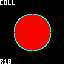
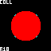
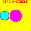
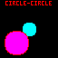

# Notes

## Circles

Circles are drawn using the [https://en.wikipedia.org/wiki/Midpoint_circle_algorithm](midpoint algorithm)

Point-circle collision detection calculates the distance from the centre of the circle to the given point using the pythagoras theorem - it's a collision if the calculated distance is less than or equal to the circle's radius

There's a slight mismatch between these two approaches, see ```PointCircleUnmodified.png``` - the cyan circle is the result of a ```drawCircle()``` call and the overlaid red circle is formed by all the collision points using the same circle parameters



This is probably not an issue most of the time:

* The error factor is very low (~1 pixel around the circumference)
* The error is always on the side of collision areas being smaller than the drawn area (generally preferable)
* Game entities tend to move at a pace that result in errors being imperceptible by the player

The resolution of fc64js being so low (64x64 pixels) does mean that the error might be more noticeable than it would be at higher resolutions

You *could* build up a list of all the points filled by ```drawCircle()``` and get truly pixel perfect collision detection, but that does seem a bit heavy for what should be a really lightweight quick and simple collision check. A hacky compromise could be to introduce a manual fudge factor to the radius (values arrived at by trial and error), see ```PointCircleModified.png```



Open ```circles/fiddle.html``` in a browser to play with this - d-pad buttons modify the radius, and a/b buttons toggle between the ```drawCircle()``` in cyan and drawing the collision points in red being drawn one over the other

The rough hack is probably more than good enough for most purposes and seems to work well enough when colliding circles with points, lines, rectangles, and polygons

I don't like the hack's results when colliding circles with other circles as there are situations that result in false positives - see ```CircleCircleModifiedFalsePositive.png```



In most cases a missed collision is preferable to a false collision, so I prefer the false negatives that occur when using the unmodified correct mathematical definition of a circle in this case - see ```CircleCircleUnmodifiedFalseNegative.png```



The call to ```applyRadiusModifier()``` is easily removed if desired

## Changes from reference examples

### PointPoint

No substantive change from [reference](https://www.jeffreythompson.org/collision-detection/point-point.php)

### PointLine / LinePoint

No substantive change from [reference](https://www.jeffreythompson.org/collision-detection/line-point.php)

### PointCircle / CirclePoint

Changes from [reference](https://www.jeffreythompson.org/collision-detection/point-circle.php):

* Applies the previously described radius modification hack
* Avoids an unnecessary square root calculation

### PointRect / RectPoint

Changes from [reference](https://www.jeffreythompson.org/collision-detection/point-rect.php):

* Fixes off by one errors when testing right/bottom rectangle edges (replaced ```<=``` with ```<```)

### PointPoly / PolyPoint

No substantive change from [reference](https://www.jeffreythompson.org/collision-detection/poly-point.php)

### LineLine

No substantive change from [reference](https://www.jeffreythompson.org/collision-detection/line-line.php)

### LineCircle / CircleLine

Changes from [reference](https://www.jeffreythompson.org/collision-detection/line-circle.php):

* Applies the previously described radius modification hack

### LineRect / RectLine

Changes from [reference](https://www.jeffreythompson.org/collision-detection/line-rect.php):

* Adds a check for one of the line ends being within the rectangle (catches the missed case where the line is entirely enclosed within the rectangle)

### LinePoly / PolyLine

Changes from [reference](https://www.jeffreythompson.org/collision-detection/poly-line.php):

* Adds a check for one of the line ends being within the polygon (catches the missed case where the line is entirely enclosed within the polygon)

### CircleCircle

Changes from [reference](https://www.jeffreythompson.org/collision-detection/circle-circle.php):

* Avoids an unnecessary square root calculation

### CircleRect / RectCircle

Changes from [reference](https://www.jeffreythompson.org/collision-detection/circle-rect.php):

* Fixes off by one errors when testing right/bottom rectangle edges (added ```-1``` to ```rect.x + rect.width``` and ```rect.y + rect.height```)
* Applies the previously described radius modification hack
* Avoids an unnecessary square root calculation

### CirclePoly / PolyCircle

No substantive change from [reference](https://www.jeffreythompson.org/collision-detection/poly-circle.php)

### RectRect

Changes from [reference](https://www.jeffreythompson.org/collision-detection/rect-rect.php):

* Fixes off by one errors when testing all rectangle edges (replaced ```>=``` with ```>``` and ```<=``` with ```<```)

### RectPoly / PolyRect

Changes from [reference](https://www.jeffreythompson.org/collision-detection/poly-rect.php):

* Fixes a relatively benign bug (only effecting efficiency) where the "rectangle is fully enclosed by the polygon" check is unnecessarily called within a loop (it only needs to be called once)

### PolyPoly

Changes from [reference](https://www.jeffreythompson.org/collision-detection/poly-poly.php):

* Fixes a relatively benign bug (only effecting efficiency) where the "polygon is fully enclosed by the other polygon" check is unnecessarily called within a loop (it only needs to be called once)

## Issues along shape edges

Some collision pairs will have small errors at the very edges, see ```PointLineIssue.png```, ```PointCircleIssue.png```, ```PointPolyIssue.png```, ```LineLineIssue.png```, ```LineCircleIssue.png```, ```LinePolyIssue.png```, ```CircleCircleIssue.png```, ```CircleRectIssue.png```, ```CirclePolyIssue.png```, ```RectPolyIssue.png```, and ```PolyPolyIssue.png``` in the ```notes/screenshots/``` directory for example edge cases (*ba-dum-tish* :D) where a collision towards the shape boundary is missed. This kind of thing is inevitable when dealing with collision detection, but is more apparent when working at very low resolutions. I don't think it poses a real world problem - the errors can be spotted when inspecting static images, but would not be all that apparent when playing a dynamic game

## Screenshots

Also in the ```notes/screenshots/``` directory are images illustrating:

* Correctly detected collisions (suffixed ```Y```)
* Correctly handled non-collisions (suffixed ```N```)
* Correctly handled cases where the user controllable shape is completely enclosed within the static shape (suffixed ```Enclosed```)
* Correctly handled cases where the user controllable shape completely covers the static shape (suffixed ```Cover```)
